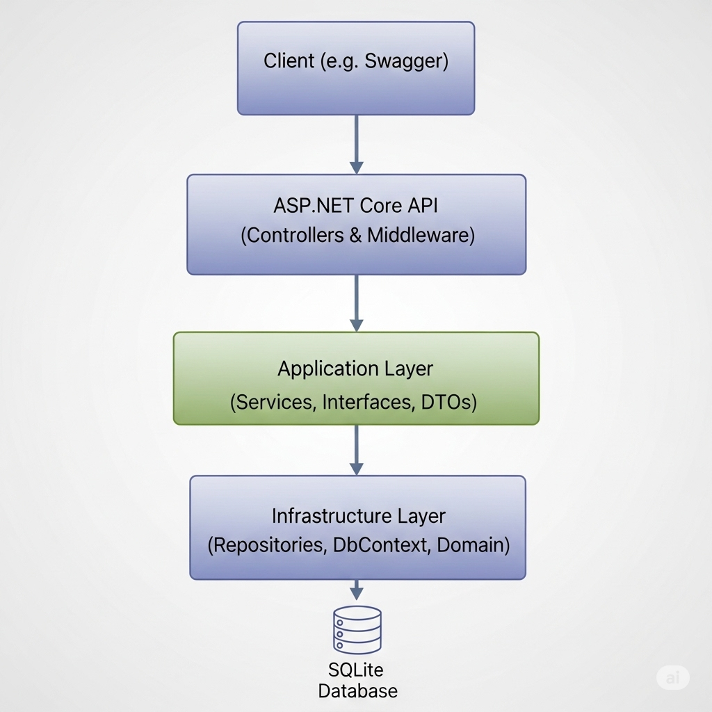
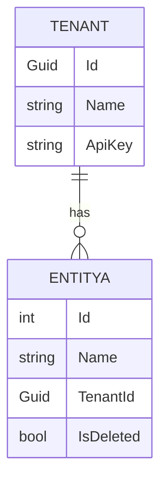
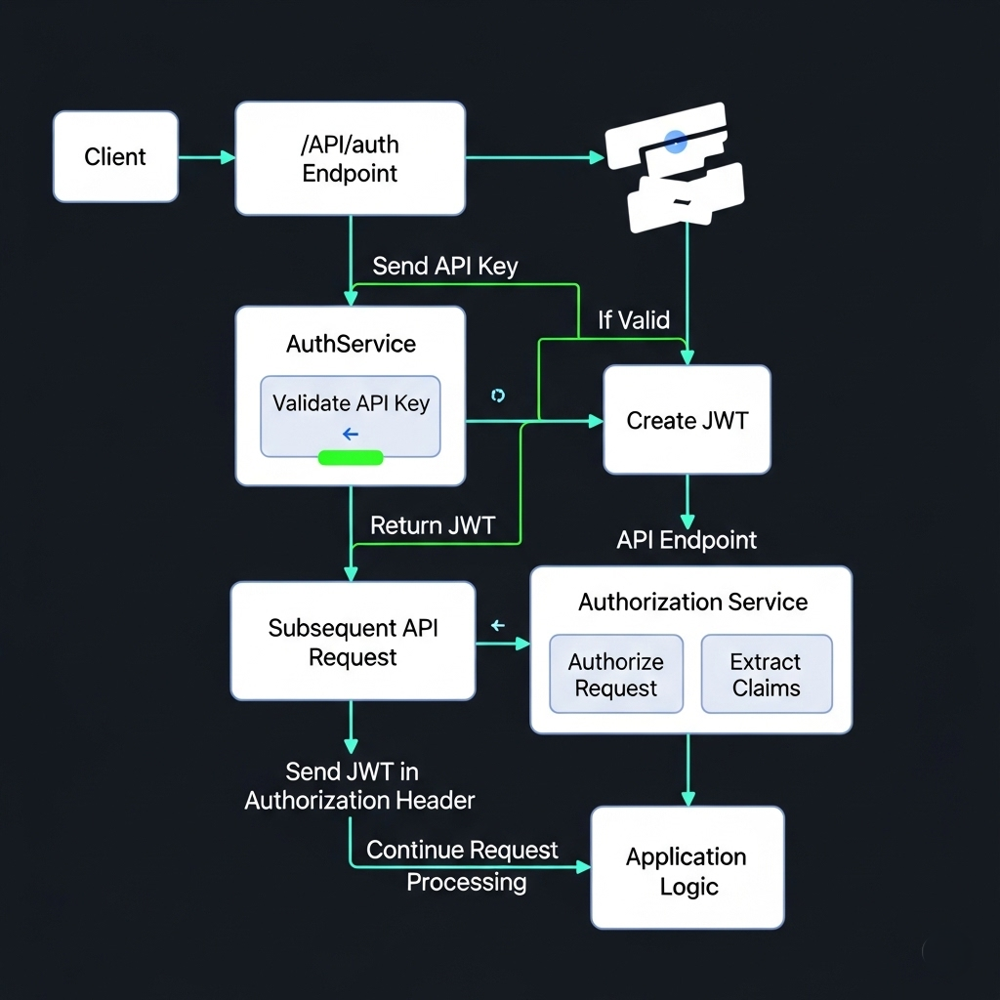
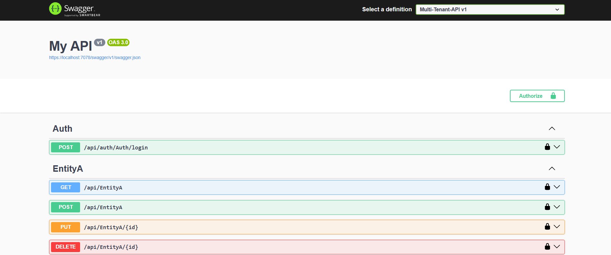

# Multi-Tenant REST API using ASP.NET Core

## 🧭 Objective

Build a robust multi-tenant RESTful API using ASP.NET Core Web API. The system supports tenant-specific data isolation, JWT-based authentication, and a clean architecture following the Repository-Service pattern.

---

## 🧱 Features

* ✅ **Multi-Tenancy** using a shared database with TenantId-based isolation
* ✅ **JWT Authentication** via API key login
* ✅ **Repository-Service Pattern**
* ✅ **Tenant Filtering Middleware**
* ✅ **Swagger API UI**
* ✅ **Dependency Injection & Configuration**
* ✅ **Logging with Serilog** 
* ✅ **Soft Deletion Strategy** 

---

## 🧬 Structure Overview

```plaintext
+---API
|   +---Controllers
|   |       AuthController.cs
|   |       EntityAController.cs
|   +---Middleware
|           TenantContextMiddleware.cs
|
+---Application
|   +---DTOs
|   |       EntityCreationDto.cs
|   |       EntityDTO.cs
|   +---Interfaces
|   |       IAuthService.cs
|   |       IEntityARepository.cs
|   |       IEntityAService.cs
|   |       IUnitOfWork.cs
|   +---Mapping
|   |       EntityAMapper.cs
|   +---Services
|           AuthService.cs
|           EntityAService.cs
|           TokenProvider.cs
|
+---Domain
|       EntityA.cs
|       Tenant.cs
|
+---Infrastructure
    +---Data
            ApplicationDbContext.cs
            EntityARepository.cs
            TenantResolver.cs
            UnitOfWork.cs
```

---
## 🧬 Archeticture Overview



---
## 📦 Technology Stack

* ASP.NET Core 7/8
* Entity Framework Core (SQLite)
* JWT Authentication
* Swagger / Swashbuckle
* Serilog

---

## 🧪 API Endpoints

All endpoints are scoped to the current authenticated tenant.

| Method | Route            | Description                          |
| ------ | ---------------- | ------------------------------------ |
| POST   | `/auth/token`    | Authenticate via API key and get JWT |
| GET    | `/entities`      | Get all tenant entities              |
| POST   | `/entities`      | Create a new tenant entity           |
| PUT    | `/entities/{id}` | Update a tenant entity               |
| DELETE | `/entities/{id}` | Delete a tenant entity               |

> ⚠️ Entities are only modifiable if they belong to the current tenant.

---

## 🔐 Authentication

* Authenticate using POST `/auth/token` and provide a tenant-specific API key.
* JWT will include the `TenantId` as a claim.
* Middleware (`TenantContextMiddleware`) will extract and use the `TenantId` throughout the request lifecycle.

---

## 🧠 Multi-Tenancy - Tenant Isolation Strategy

* Shared database
* Each entity contains a `TenantId` foreign key
* Repositories/services apply filtering on `TenantId`
* Middleware sets current `TenantId` from JWT claim to a scoped context

---

## 🗂️ Entities

### Tenant

```csharp
public class Tenant {
    public Guid Id { get; set; }
    public string Name { get; set; }
    public string ApiKey { get; set; }
}
```

### EntityA (e.g., Product/Project)

```csharp
public class EntityA {
    public int Id { get; set; }
    public string Name { get; set; }
    public Guid TenantId { get; set; }
    public Tenant Tenant { get; set; }
    public bool IsDeleted { get; set; }

}
```

---

## 🔧 Setup Instructions

```bash
# Clone the project
$ git clone https://github.com/your-username/your-repo.git

# Navigate to the project directory
$ cd your-repo

# Restore dependencies
$ dotnet restore

# Run migrations 
$ dotnet ef database update

# Run the app
$ dotnet run
```

Visit `http://localhost:5000/swagger` to test endpoints with Swagger.

---

## 🧪 Testing the API

* Swagger UI is enabled by default.
* Paste the JWT token into Swagger's "Authorize" button.
* Use the `/auth/token` endpoint to retrieve a token using your tenant API key.

---


## 🧩 Visuals and Diagrams

### 📌 Entity Relationship Diagram (ERD)



### 🔄 Sequence Diagram (Auth & Request Flow)




---
## 📹 Demo Video

Watch the app in action:

[](https://drive.google.com/file/d/15LTJQF3kxSskoZGLdGy7R9k5kWy7QnW-/view?usp=sharing)


## 📘 Notes

* Use `[Authorize]` attribute on tenant-specific endpoints.
* Use scoped service to access current `TenantId`.
* Securely store `ApiKeys` (e.g., hashed or encrypted in DB).
* Add Jwt secret in the secrets file in VS

---

## 👨‍💻 Author

**Mohamed Saied** — [LinkedIn](https://www.linkedin.com/in/mohamed-saied-cs/) · [GitHub](https://github.com/MSaiedd)
